 

 

> I build **secure, scalable backends** and **clean frontends** for healthcare and file-system tools, with a focus on **FastAPI**, **React**, and **good system design**.

- 🔭 **Currently working on:**
  - **[SmartFile](https://github.com/aishwar-ya/SmartFile)**: duplicate detection & storage optimization (FastAPI + React + SHA-256)
  - **[VijayaGreen](https://github.com/aishwar-ya/VijayaGreen)**: garden & nursery accounting app for a family business (Flutter + SQLite)
  - **[medi_mate](https://github.com/aishwar-ya/medi_mate)**: Flutter medication management app with reminders, hydration tracking, stock monitoring, barcode scanning, and voice reminders
  - **Smart Patient Care System**: healthcare project built around hand gesture recognition *(private)*
  - **[cyber-crime-lab](https://github.com/aishwar-ya/cyber-crime-lab)**: digital evidence management with MD5 / SHA-256 hash verification and chain of custody (Flask)
- 🛠️ **Tech stack:** Python, FastAPI, Flask, React, JavaScript, Flutter, Dart, SQLite, Git
- 🌱 **Learning:** Advanced Data Structures, System Design, Cloud Security
- 💬 **Ask me about:** Python scripting, REST APIs, hashing algorithms, backend architecture

<table>
<tr>
<td width="50%" valign="top">

### 🗂️ SmartFile
**Duplicate detection & storage optimization**

`FastAPI` `React` `SHA-256`

- Detects duplicate files using content-based hashing
- REST API for upload, scan, and cleanup
- React frontend for interactive file management
- Safe cleanup with backup & undo

[**View on GitHub →**](https://github.com/aishwar-ya/SmartFile)

</td>
<td width="50%" valign="top">

### 🌿 VijayaGreen
**Garden & nursery accounting application**

`Flutter` `Dart` `SQLite`

- Built for Vijaya Garden, a family-owned nursery business
- Income, expenses, ledger, customers, suppliers, and reports
- All records stored locally in SQLite

[**View on GitHub →**](https://github.com/aishwar-ya/VijayaGreen)

</td>
</tr>
<tr>
<td width="50%" valign="top">

### 💊 medi_mate
**Medication management app**

`Flutter` `Dart` `Healthcare`

- Medicine management with scheduled reminders
- Hydration tracking and medicine stock monitoring
- Barcode scanning and voice-based reminders

[**View on GitHub →**](https://github.com/aishwar-ya/medi_mate)

</td>
<td width="50%" valign="top">

### 🖐️ Smart Patient Care System
**Hand gesture recognition for healthcare**

`Python` `Healthcare`

- Patient-care system built around hand gesture recognition

🔒 *Private repository*

</td>
</tr>
<tr>
<td width="50%" valign="top">

### 🔐 cyber-crime-lab
**Digital evidence management & forensic hash verification**

`Python` `Flask` `SQLite`

- Create cases and upload digital evidence
- MD5 and SHA-256 hashes with a chain-of-custody log
- PDF forensic case reports

[**View on GitHub →**](https://github.com/aishwar-ya/cyber-crime-lab)

</td>
<td width="50%" valign="top">

### 🎰 slot_machine-game
**Small Python game**

`Python`

- Picks three random symbols using the `random` module
- Jackpot when all three are 7️⃣

[**View on GitHub →**](https://github.com/aishwar-ya/slot_machine-game)

</td>
</tr>
</table>

### 📊 GitHub Stats

  
  

- **Backend / Full-stack** roles with **Python**, **FastAPI**, **Node/React**, or **Flutter**
- Work on **scalable APIs**, **secure systems**, and **data-heavy applications**
- Teams that value **clean code**, **tests**, and **thoughtful design**

  
  

